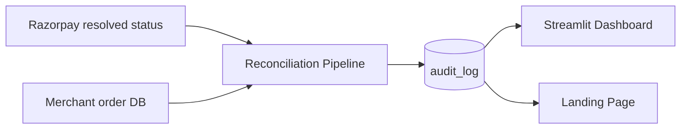
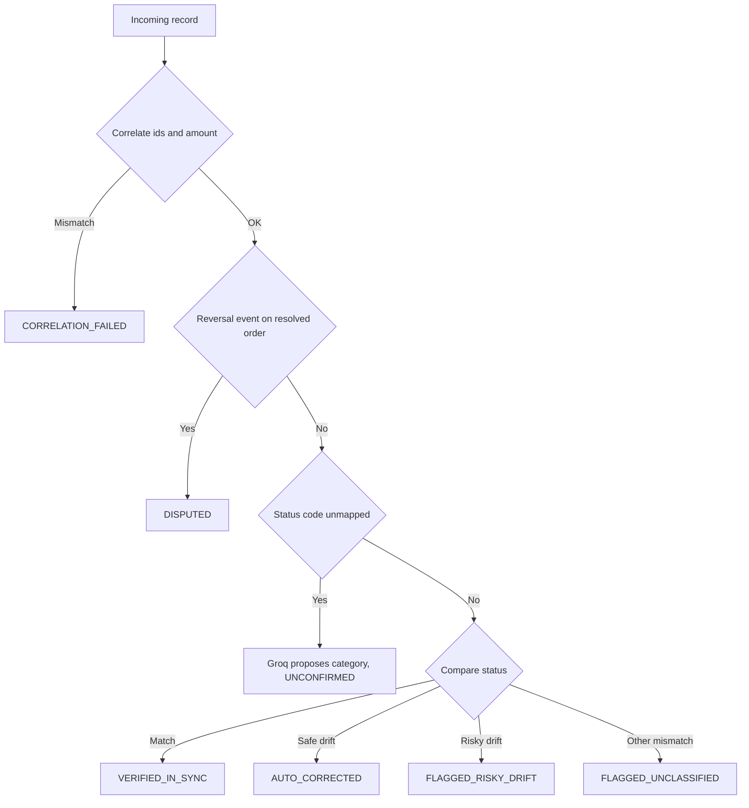

# Order Sync Agent

**Razorpay already knows what happened to a payment. This makes sure your system does too.**

   

**[Live landing page](https://khushi-tyagi9.github.io/payment-resolver-engine/)** · **[Live dashboard](https://payment-resolver-engine.streamlit.app/)** · Razorpay AI Buildathon 2026

---

## The problem

Razorpay already reconciles the bank and the gateway internally. Late authorization exists specifically so a payment initially marked `Failed` can flip to `Authorized` once the real bank response lands. What it has no visibility into is whether *your own order table* actually caught up.

This isn't hypothetical. A documented bug in the WooCommerce Razorpay plugin left a successful renewal payment marked `pending`, despite Razorpay firing the webhook correctly. Nothing ever checked whether the merchant's database reflected it. Razorpay's records were right. The merchant's were wrong. Nothing caught it until a customer complained.

**This is the reconciliation layer for that exact gap.**

## What it does

A deterministic batch engine that compares Razorpay's resolved payment status against a merchant's own order record, catches drift in either direction, takes a bounded and direction-aware recovery action, and logs every decision to an auditable trail.



```
resolver/
  data_generator.py   synthetic orders_batch: 32 clean matches, 8 safe-direction
                       drift, 4 risky-direction drift, 1 unclassified drift,
                       2 reversal events, 1 unmapped code, 2 correlation failures
  lookup.py            error_code_lookup: raw razorpay_status to SUCCESS/FAILED/PENDING
  correlate.py         payment_id must map to exactly one order_id + amount
  compare.py           pure drift comparison (MATCH / DRIFT_SAFE / DRIFT_RISKY / DRIFT_OTHER)
  actions.py           direction-aware recovery decision (pure, no I/O)
  classifier.py        Groq LLM call, classifies an unmapped status code only
  db.py                SQLite: orders_batch (input) + audit_log (output)
  pipeline.py          correlate then reversal check then unmapped check then compare then act then log

run_reconciliation.py   entry point: generate batch, run pipeline, print summary
app.py                  Streamlit dashboard, self-initializes if the database is missing
tests/                  unit tests for correlation + drift comparison
```

## Processing logic, per record, in order



1. **Correlate**: does `razorpay_payment_id` map to exactly one `order_id` with a matching amount across the whole batch? If not: `CORRELATION_FAILED`, skip. This always runs first, so nothing is ever compared against a record it doesn't actually belong to.
2. **Reversal check**: a `SETTLEMENT_REVERSED` event on an already-resolved order routes to `DISPUTED`, never silently dropped.
3. **Unmapped code check**: a `razorpay_status` outside the lookup table gets one Groq call to propose a category, logged as `UNCONFIRMED_CLASSIFICATION`. The proposal is never auto-executed.
4. **Compare**:
   - Match → `VERIFIED_IN_SYNC`
   - Razorpay=SUCCESS, merchant=PENDING/FAILED → **auto-corrected**
   - Razorpay=FAILED, merchant=SUCCESS → **flagged only, never auto-corrected, regardless of confidence.** This direction could mean fraud, not lag.
   - Any other mismatch → flagged as `FLAGGED_UNCLASSIFIED`, kept distinct from risky drift since the reasoning differs even though neither auto-corrects
5. **Idempotency**: `record_id` is a primary key on `audit_log`. Re-running the pipeline never duplicates a row.

Every comparison, correction, and gate is deterministic Python. **The only LLM call anywhere in the system is the unmapped-code classifier**, and its output is always logged as unconfirmed, never acted on automatically.

## Real numbers, from an actual run

| Outcome | Count |
|---|---|
| Verified in sync | 32 |
| Auto-corrected | 8 |
| Flagged (risky drift + unclassified) | 5 |
| Disputed (reversal caught) | 2 |
| AI-classified (unmapped, unconfirmed) | 1 |
| Correlation failures caught | 2 |
| **Total** | **50** |
| **Recovered** | **₹245,443** |

Every number here, and every number on the landing page, is generated directly from `audit_log`. None of it is hand-typed.

## This was verified, not just built

- Wiped the database and re-ran the pipeline against untouched input to confirm reproducibility
- Injected a hand-crafted record never seen during generation and confirmed the decision logic resolves it correctly, not by memorized lookup
- Broke the Groq API key on purpose and confirmed the pipeline fails loudly, proving the LLM call is live, not stubbed
- Read the actual comparison and action functions line by line to confirm real conditional logic, not a precomputed answer table

## Getting started

```bash
pip install -r requirements.txt
cp .env.example .env   # then set GROQ_API_KEY=your_key
```

Run the full pipeline:

```bash
python run_reconciliation.py
```

Regenerates `data/payment_resolver.db` from scratch, seeds `orders_batch`, processes every record, and prints a real summary block.

View the dashboard:

```bash
streamlit run app.py
```

Self-initializes the database automatically if it doesn't exist yet. No manual setup step required.

Run the tests:

```bash
python -m unittest discover -s tests
```

## Landing page

`docs/index.html` is a static, self-contained page (GitHub Pages, `master` branch, `/docs`). Every figure on it is templated from the real database, never hand-typed. Regenerate after a fresh run:

```bash
python run_reconciliation.py
python generate_landing_page.py
```

## What this deliberately doesn't do

Scoped down from a real-time, webhook-driven design to a single deterministic batch run, on purpose, to guarantee measured, honest results rather than a beautifully designed system with nothing to show. No live webhook listener, no signature verification, no concurrency handling, no time-decay windows. The reasoning behind that scoping, and the fuller real-time design it was cut from, is worth a conversation, not a rebuild.

---

Built for the Razorpay AI Buildathon 2026, Track 3: AI Revenue Recovery.
